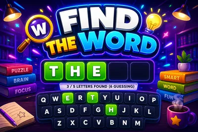

# Find the Word - Interactive TikTok Live Game

> A hidden word your whole chat races to spell out.

A live word race for your whole chat. A secret word hides as blank tiles and viewers race to guess it in chat. Any guess that matches more of the word than is shown instantly uncovers those letters for everyone. First to complete the word wins the round.

**[Play Find the Word on Livecade](https://livecade.io/games/find-the-word/?utm_source=github&utm_medium=readme&utm_campaign=find-the-word)** - runs as a single browser source in OBS, Streamlabs, or TikTok LIVE Studio. Nothing for viewers to install.

## How viewers play

Viewers take part with the actions TikTok already gives them: **comments**, **gifts**. Every action below is rebindable, so you decide which interaction drives which effect.

| Action | What it does |
| --- | --- |
| **Reveal a letter** | Uncovers one more letter of the hidden word for everyone and credits the gifter, but never the last letter |

## How it works

### Every comment is a guess

A secret word hides as blank tiles. Any guess that matches more of the word's start than is shown instantly flips those letters open, in green, for the whole room, and scores the guesser points per letter.

### Gifts push the reveal

A gift uncovers one more letter to help the crowd close in, but it can never reveal the final letter. Gifts help chat along, but the winning word still has to be typed.

### First to spell it wins

The first viewer to type the complete word wins the round early with a bonus, gets read aloud, and tops the round and session leaderboards, then a fresh word begins.

## About the game

Find the Word turns your chat into a live word race that runs itself. A secret word sits on screen as blank tiles, and every comment is a guess: the moment a viewer types a guess that shares more of the word's start than is currently revealed, those letters flip open in green for the whole room and that guesser scores points per letter.

### A gift can help, but never buy the round

Gifts push the reveal one letter further to help the crowd close in, but never uncover the final letter, so the winning word still has to be typed by somebody.

### Runs itself, round after round

The first viewer to type the complete word wins the round early with a bonus, gets read aloud, and tops the round and session leaderboards, then a fresh word begins after a short break. Run it on a per-round timer or play until solved, tune the scoring, and pick from twelve languages, each with its own native bank of two thousand or more words so nothing repeats until the whole bank cycles.

## Gameplay

[Watch Find the Word gameplay](https://cdn.livecade.io/games/find-the-word.mp4)

## What you can configure

- **Language** - Twelve languages, each with its own native word bank
- **Round mode** - A fixed countdown per round, or play until someone solves it
- **Round time** - How long each timed round runs
- **Seconds between rounds** - The break length before the next word
- **Points per letter and completion bonus** - Points for each letter uncovered, plus a bonus for whoever completes the word
- **Limit guesses per viewer** - Optionally cap how many guesses each viewer gets per round
- **Leaderboards** - Show a live round board and a session board, and how many entries
- **Read the winner aloud** - Text-to-speech announcement of the round winner
- **Background** - Transparent, a solid color, or your own image

## Languages

English, Spanish, Portuguese, French, German, Italian, Indonesian, Arabic, Turkish, Russian, Hindi, Romanian

## FAQ

<strong>How do viewers play Find the Word?</strong>

Viewers just type guesses in your TikTok Live chat. Any guess that matches more of the hidden word's start than is currently shown instantly uncovers those letters for everyone, and the first to type the whole word wins the round.

<strong>Do viewers need to send gifts to play?</strong>

No. Guessing is free and comment-driven. Gifts uncover one extra letter to help the whole room close in, but never the final one, so gifting helps chat without ever buying the win outright.

<strong>What languages does it support?</strong>

Twelve languages, and each one has its own native word bank of two thousand or more words rather than a translation of an English list. Viewers guess in whichever language you set for the show.

<strong>How do I add Find the Word to my TikTok Live?</strong>

Add one browser source URL to OBS or your streaming software and go live. There is no plugin to install and nothing for your viewers to download.

## Setup

1. [Create a Livecade account](https://app.livecade.io/register?utm_source=github&utm_medium=cta&utm_campaign=find-the-word)
2. Copy your overlay browser source URL
3. Paste it into OBS, Streamlabs, or TikTok LIVE Studio
4. Pick Find the Word, set your triggers, and go live

Runs in the browser, so it works on Windows and macOS with nothing to download. [See all TikTok Live games](https://livecade.io/tiktok-live-games/?utm_source=github&utm_medium=readme&utm_campaign=find-the-word).

---

_This repository documents Find the Word, a hosted interactive game by [Livecade](https://livecade.io/?utm_source=github&utm_medium=footer&utm_campaign=find-the-word). The game runs on Livecade's platform, so there is no source to install here._
